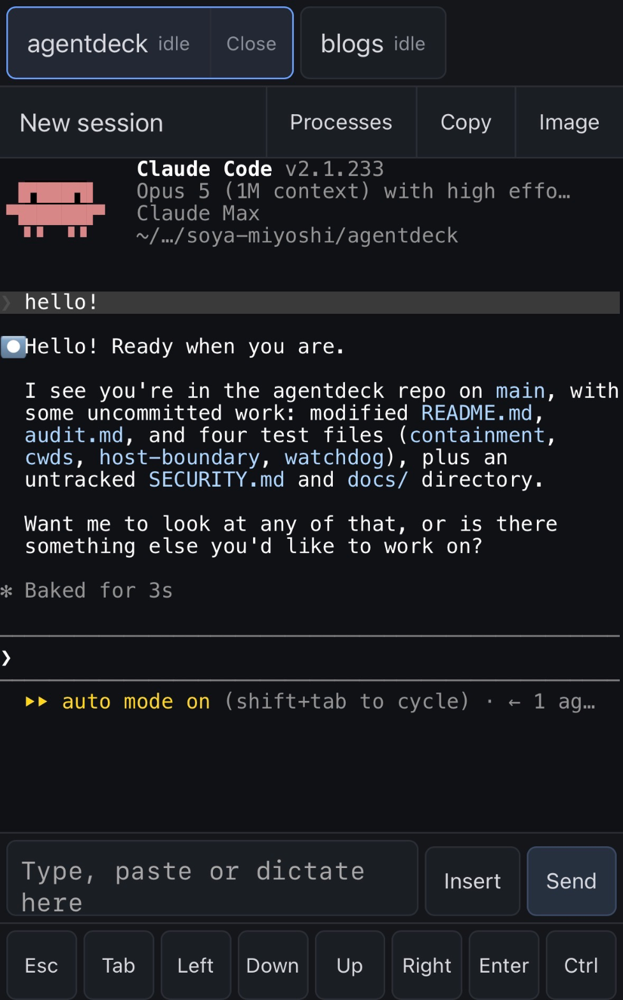

# agentdeck

Run coding-agent sessions on your Mac, drive them from your phone.

<p align="center">
  
</p>

One tmux session per repository, one tab per session. Each tab shows whether that agent is working,
waiting for you, or has exited, and streams its live terminal output over a WebSocket. No database:
scrollback lives in tmux for as long as tmux does.

## How it works

The server binds loopback only. Tailscale is what carries the phone to it, over your own tailnet
with a real TLS certificate — nothing is exposed to the public internet.

```
   iPhone / iPad                              Your Mac
 ┌───────────────┐                ┌──────────────────────────────────────┐
 │  PWA          │                │  tailscaled                          │
 │  tab strip    │   HTTPS / WSS  │    └─ tailscale serve :443           │
 │  xterm.js     │◀──────────────▶│         └─▶ 127.0.0.1:7777           │
 │  status dots  │    tailnet     │              agentdeck (node)        │
 │  key row      │    only        │                ├─ node-pty           │
 └───────────────┘                │                ├─ session registry   │
   bearer token in                │                └─ ring buffer (RAM)  │
   localStorage                   │                       │              │
                                  │              tmux -L agentdeck       │
                                  │                ├─ session: repo-a    │
                                  │                ├─ session: repo-b    │
                                  │                └─ session: repo-c    │
                                  │              one per ghq repository  │
                                  └──────────────────────────────────────┘
```

- The **allowlist** is the set of directories a session may start in. `make start` fills it from
  `ghq root --all`, so every repository you have cloned with ghq is startable and a new clone needs
  no restart.
- A **bearer token** guards every `/api` route and the WebSocket upgrade. It is generated on first
  run and printed as a QR code for the phone.
- **tmux owns the processes.** Stopping or restarting the server does not stop your agents; the
  restarted server adopts them back.

## Requirements

- **macOS**, with **tmux** installed.
- **Node 22.18+** and **pnpm 9** (both pinned in `mise.toml` — `mise install` gets them).
- **[ghq](https://github.com/x-motemen/ghq)**. agentdeck's default launch path derives its allowlist
  from `ghq root --all`, so your repositories are expected to live under a ghq root. Without ghq,
  set `AGENTDECK_MOUNTS` by hand instead (see [Environment](#environment)).
- **[Tailscale](https://tailscale.com/)** on both the Mac and the phone. This is not optional for
  phone access: the server listens on `127.0.0.1` and never on a LAN address.
- At least one agent CLI you want to run — Claude Code, Gemini CLI, or just a shell.

## Setup

```sh
mise install
pnpm install --frozen-lockfile
pnpm build            # builds the phone client into dist/client
```

**1. Agent profiles.** These decide what command each session runs, so keep the file **outside**
every repository an agent can write. The server refuses to start if it is inside an allowlisted
directory.

```sh
mkdir -p ~/.agentdeck
cp agents.example.json ~/.agentdeck/agents.json
```

```json
{
  "claude": {
    "name": "Claude Code",
    "command": "claude",
    "waiting": { "via": "hook", "settings": "settings.json" }
  },
  "shell": { "name": "Shell", "command": "/bin/zsh" }
}
```

**2. `.env`.** Copy the example and edit it. Node's parser does no expansion, so every path must be
absolute — no `~`, no `$HOME`.

```sh
cp .env.example .env
```

```sh
AGENTDECK_PROFILES=/Users/you/.agentdeck/agents.json
AGENTDECK_ORIGIN=https://your-mac.your-tailnet.ts.net
```

## Tailscale

Two switches are **off by default** in the Tailscale admin console, and both are needed:

- **HTTPS Certificates** — <https://login.tailscale.com/admin/dns>
- **Serve** — for your tailnet

With Serve off, `tailscale serve` **hangs** rather than failing, which reads like a wedged machine
rather than a refusal. With the server already running:

```sh
AGENTDECK_PORT=7777 node scripts/tailscale-serve.mjs
```

That script checks both switches first, applies the proxy, verifies `/api/health` over both loopback
and the `ts.net` URL, and prints the exact `AGENTDECK_ORIGIN=https://<host>.ts.net` line to put in
your `.env`. It exits non-zero on any failure, so a green run is the whole verification.

By hand, the same thing:

```sh
tailscale serve --bg 7777       # run with a timeout: it blocks forever if Serve is off
tailscale serve status          # what is configured, and the https:// URL
tailscale serve reset           # take it down
```

**Never `tailscale funnel`.** That is the public internet, and nothing here is built to survive it.

Give agentdeck its own `ts.net` hostname. The token lives in `localStorage`, which is keyed by
origin, so any other service mounted on the same hostname can read a credential that starts and
kills sessions in every allowed repository.

## Running it

```sh
make start      # foreground, allowlist from `ghq root --all`
make stop       # stops the server, not the agents
make restart    # detached restart; safe to run from inside the deck itself
make up         # start with the watchdog supervising (restarts a crashed server)
make down       # stop the watchdog, then the server
make mounts     # the roots, and what is startable under them right now
```

`make restart` is the one to use **from the phone**: `stop` followed by `start` cannot work there,
because `start` runs in the foreground and stopping the server kills the socket carrying your
keystrokes. Restarting costs a session nothing — tmux holds the agents, and the server adopts them
back. The per-session hook secret comes back too: it is derived, `HMAC(bearer token, session id)`, so
a restarted server recomputes what the running agent already holds, and status detection survives.

Neither `make up` nor the watchdog survives a reboot; installing a launchd job is yours to do. See
[`docs/watchdog.md`](docs/watchdog.md).

### Getting the token onto the phone

The first run — and any run after you delete `~/.agentdeck/token` — prints the token as a QR code
with the URL beside it. Scan it with the phone's camera and paste the result into the app's token
field. The QR carries the **token alone**, not a URL containing it, so it never lands in browser
history or a `Referer` header. The token file must live outside every repository a session can start
in, and the server refuses to start if that path resolves inside an allowlist entry.

**Do not do the first run in a recorded pane.** tmux `capture-pane`, `script`, terminal session
logging and screen recordings all preserve it verbatim. If that happened, treat the token as
disclosed: delete the file, restart, re-scan everywhere.

There is no expiry and no revocation list. The only way to invalidate a token is to delete the file
and restart, which invalidates it for every device at once.

### Installing to the home screen

Open the `https://<host>.ts.net` URL in **Safari** on iOS (Chrome cannot add to the home screen),
then Share → Add to Home Screen. It launches with no browser chrome. A service worker needs a secure
context, so this only works over the Tailscale HTTPS URL, not over `http://<mac>:7777`.

## Using it from the phone

**You type into the box, not into the terminal.** Everything you write goes into the text area above
the key row and reaches the pty on one submit. Typing straight into xterm cost a network round trip
per character, offered no paste menu, and sent a Japanese IME's half-composed text to the agent.

- **Send** appends CR — what submits a line at a prompt.
- **Insert** sends the text with no CR, for a path or a fragment.
- Newlines inside the box stay LF, so a pasted five-line question is one turn, not five.
- **Copy** puts the pane's text on the clipboard — the selection if there is one, the visible screen
  if not. On a phone this is the only way text leaves that screen, since dragging scrolls the pane.

A soft keyboard has no Escape, Tab, arrows or Ctrl, and those are exactly the keys an agent's
permission prompt is answered with. The **key row** along the bottom sends them as raw bytes.
**Ctrl latches** rather than being held: tap Ctrl, then the next thing sent goes as its control code.
Ctrl, `c`, Send is `0x03`, and it is the way to interrupt an agent.

## Environment

Everything is optional; the row says what leaving it unset means.

| Variable                     | Default                    | Unset means                                                                                                                                     |
| ---------------------------- | -------------------------- | ----------------------------------------------------------------------------------------------------------------------------------------------- |
| `AGENTDECK_PORT`             | `7777`                     | Loopback either way; `tailscale serve` decides exposure.                                                                                        |
| `AGENTDECK_PROFILES`         | none                       | No agents, so nothing to start. Must be outside every allowlisted directory.                                                                    |
| `AGENTDECK_ROOTS`            | empty                      | Colon-separated absolute paths scanned for repositories, re-read on every check. `make start` passes `ghq root --all`. The root itself is not startable. |
| `AGENTDECK_MOUNTS`           | empty                      | Colon-separated absolute paths, fixed at boot, exact match and never prefix. With `AGENTDECK_ROOTS` also empty, nothing is startable.           |
| `AGENTDECK_ORIGIN`           | none                       | **The Origin check is off**, so any page your browser visits can drive the socket with a token it holds. Set it to the `https://<host>.ts.net` origin. |
| `AGENTDECK_TOKEN_FILE`       | `~/.agentdeck/token`       | Created 0600 on first run. Never inside an allowlisted directory — the server refuses to start.                                                 |
| `AGENTDECK_AGENT_STATE_DIR`  | `~/.agentdeck/agent-state` | Where hook settings land, for status detection.                                                                                                 |
| `AGENTDECK_TURNS_DIR`        | `~/.agentdeck/turns`       | One 0600 JSONL file per session, in plain text. It outlives the tmux session.                                                                   |
| `AGENTDECK_UPLOAD_DIR`       | `~/.agentdeck/uploads`     | Where images sent from the phone are written, 0600, newest 20 per session.                                                                      |
| `TMUX_SOCKET`                | `agentdeck`                | The `-L` name. Sessions are found on this socket and nowhere else.                                                                              |
| `AGENTDECK_REAP_INTERVAL_MS` | `3600000`                  | How often the server collects abandoned processes. **It kills things.** `0` turns it off; see [Housekeeping](#housekeeping).                    |

A session's environment is **built, not inherited**: a pane gets `PATH`, `HOME`, `SHELL`, `TERM`,
`LANG`, `LC_ALL`, `TMPDIR`, `USER`, `LOGNAME`, plus whatever its profile lists. `SSH_AUTH_SOCK` above
all is left out — a forwarded ssh-agent is `git push --force` to every repository that key reaches.
But `HOME` has to be there, so an interactive shell reading your dotfiles can put it back. Keeping a
credential out of a session means keeping it out of the dotfiles `HOME` points at.

## What you are accepting

**It runs as you, with no sandbox.** An agent that runs `rm -rf ~` or a poisoned `curl | sh` reaches
your home directory, your SSH keys, your browser profiles and every other repository. The allowlist
decides where a session _starts_, not where it can reach. **A git remote is what protects the work.**

That blast radius includes agentdeck's own checkout, and the host then executes parts of it — the
`package.json` scripts, the lockfile, the lint and toolchain config, the tests. Review a diff before
running the toolchain in a checkout an agent has been working in.

**Read [`SECURITY.md`](SECURITY.md) before using this on a machine that matters.** It has the full
list, the review checklist, how the bearer token is handled, and what a separate user account would
and would not fix.

## Housekeeping

Agents leave processes behind — a `nohup`ed build, a polling loop, a tmux server nothing reaped. The
running server collects them hourly and says so on boot. To look before acting:

```sh
make reap        # what is collectable, and nothing happens
make reap-kill   # the same pass, acting
```

Three defaults are worth knowing. A `pnpm dev` whose terminal has closed **is** collected, with its
whole tree (`AGENTDECK_REAP_SPARE_LISTENERS=1` spares it). What a live agent started is collected
too, except MCP servers (`AGENTDECK_REAP_KEEP`); the agent process itself is never touched. Only
agentdeck's own tmux socket is in scope, never your personal one.

Closing a session from the phone ends its whole tree, MCP servers included.

## Non-goals

No file browsing or editing, no git/GitHub integration, no MCP broker or plugin system, no
multi-user access or public exposure, no persistence of terminal output beyond tmux's own lifetime,
and no desktop UI — the desktop already has a terminal.

Six runtime dependencies, and that is the budget: `node-pty`, `ws`, `vue`, `@xterm/xterm`,
`@xterm/addon-fit`, `qrcode-generator`.

## Development

```sh
pnpm typecheck && pnpm lint && pnpm test   # ~40s
```

For iterating on the client, Vite's dev server proxies `/api` and `/ws` to the server on 7777:

```sh
make start        # one terminal
pnpm dev          # another; the page comes from Vite on 7778
```

`AGENTDECK_ORIGIN` must be unset or set to the Vite origin for that flow, or the server answers 403
to the upgrade and the client reconnects forever instead of saying so.
